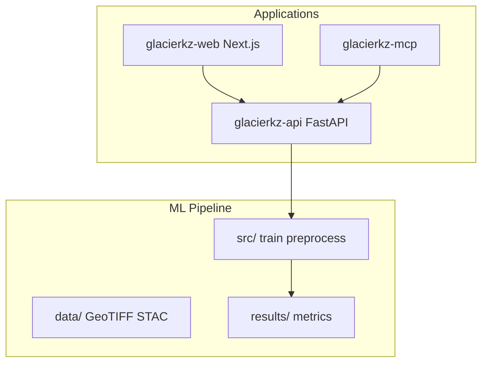

# GlacierNET-KZ — Architecture

Glacier retreat monitoring for Kazakhstan (Zailiysky / Jungar Alatau) using satellite imagery, U-Net segmentation, FastAPI services, and Next.js dashboard.

## System map

## `src/` (ML)

Key modules: `config.py`, `data_loader.py`, `train.py`, `ensemble.py`, `evaluation.py`, `preprocessing.py`, `metrics.py`.  
Notebooks `01–06` document research workflow.

## `glacierkz-api/`

- `app/main.py` — FastAPI app, middleware stack, router mounts
- `app/routers/` — analysis, training, dashboard, segmentation, admin, mcp, …
- `app/middleware/` — rate limit, cache, security headers, `admin_auth`
- `app/auth/` — RBAC

## `glacierkz-web/`

Next.js dashboard (hub, maps, reports). Talks to API — keep env URLs consistent.

## Data & reproducibility

- `data/raw/sentinel2/`, Landsat, `data/wgms/` — scientific inputs
- `docs/REPRODUCIBILITY.md`, `docs/DATA_CITATION.md` — binding for science claims
- `results/` — generated outputs (F1, inventory, STAC catalog)

## Extension points

| Feature | Where |
|---------|--------|
| New model | `src/` + training router |
| New API endpoint | `glacierkz-api/app/routers/` |
| New viz | `glacierkz-web/` |
| Competition docs | `competition/` |

## Out of scope

- Bulk edits under `data/raw/` without user
- `node_modules/`, `.venv*/`
- HuggingFace Spaces deploy unless ops task
